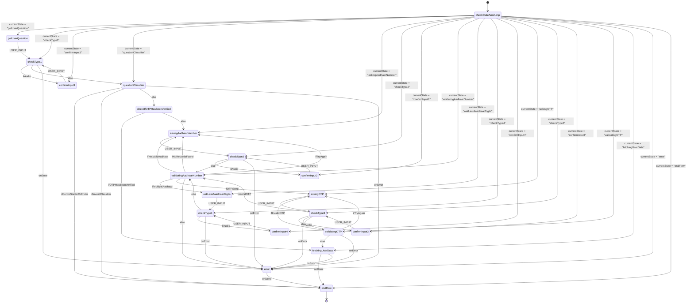

## PM KISAN Handover session 1
---
### 1. Architecture.
[[](https://drive.google.com/file/d/15ERCcbI5Ugm264h6fTpgZklRPOgVGSxN/view)](https://drive.google.com/file/d/15ERCcbI5Ugm264h6fTpgZklRPOgVGSxN/view?usp=sharing
)

Xstate Diagram



### 2. Tech stack used.

- NodeJS (NestJS)
- Prisma
- Redis

### 3. Project setup.

To integrate BFF into your project, follow these steps:

1. Clone the repository.
```sh
git clone https://github.com/AgrI-Mitra/bff.git
```

2. Setting up the server

```sh
# Setup DB and Hasura
# For Local:
docker-compose -f ./docker-compose.local.yaml up -d --build
# For Server:
ocker-compose up -d

# Migrate Database
npx prisma migrate dev
# Due to a certain glitch in the matrix, doing it twice works for dev setup.

# Start dev server
yarn start:dev
```
[Deployment steps](https://github.com/AgrI-Mitra/docs/blob/main/deployment.md)

4. Deploy and run BFF to start orchestrating API calls and managing the conversation flow.
### 3. Code structure.
```
project-root/
│
├── src/
│   ├── common/
│   ├── global-services/
│   ├── modules/
│   ├── xstate/
|   ├── app.controller.ts
|   ├── app.module.ts
|   └── app.service.ts
|
└── prisma/
    ├── migrations/
    └── schema.prisma/
```
### 5. Overview of DB schema.


Schema details: https://github.com/AgrI-Mitra/docs/blob/main/Database.md
### 6. Overview of APIs.

Backend APIs:
https://api.postman.com/collections/12306310-8d8d72c8-456d-4233-85c2-6d61d22f2164?access_key=PMAT-01JC2KXC1H3E85THTTS8CVB04G

External APIs:
1. Bhashini:
   https://api.postman.com/collections/12306310-1b450077-8f4e-447c-b7a7-7221263798ad?access_key=PMAT-01JC2N1WJSG6JTW91HK794E452
2. PM KISAN and Wadhwani:
   https://api.postman.com/collections/12306310-99206e81-40ae-41bc-af77-b0935067b5c8?access_key=PMAT-01JDV151RFKF5QQR3DGEEWM020

### 7. Methods to debug issues.

- Debugging via logs.
- Debugging through Xstate.
